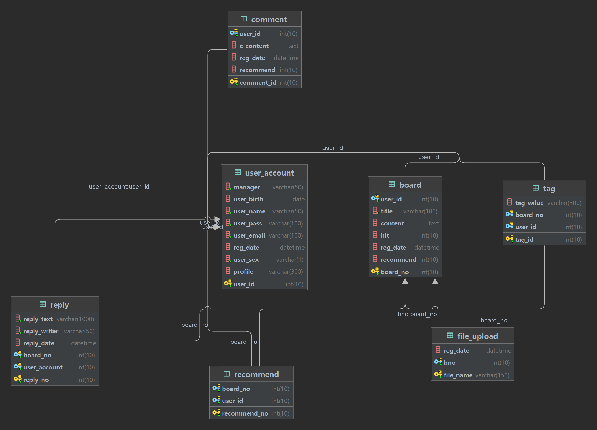

# SL Final Project

## 주제 : Pinterest + 커뮤니티
[Pintereset](https://www.pinterest.co.kr/) 

## 시나리오 

### 갤러리
#### 로그인
- 첫 화면에 관심사들을 기반으로 검색한 이미지들 출력
- TopBar(글로보기, 마이페이지(태그 편집), 로그아웃)
- 글로 보기 클릭시 일반적인 게시판으로 전환(TopBar-> 자유게시판(등록일 순 나열+인기글나열),나의 관심사)
- 글 상세 조회시 태그들을 개인 정보에 추가
#### 비로그인
- 인기 태그에 관련된 사진들 출력
### 커뮤니티
#### 비로그인
- 메인 페이지 - 조회수가 높은 글, 댓글이 많은 글, 인기 태그가 출력 
- 글 목록 - 각 글의 글 제목, 작성자, 작성일, 조회수, 추천수 출력
- 글 조회 - 제목, 작성자, 작성시간, 조회수, 추천수, 글 내용, 태그, 댓글 출력
#### 로그인
- 글 목록 - 사용자 추천 여부 표시
- 글 조회 - 댓글 작성 가능

## SQL

<h3>

user_account

 <table>
    <th>칼럼</th>
    <th>TYPE</th>
    <tr>
        <td>user_id</td>
        <td>INT(10) AUTO_INCREMENT  PrimaryKey</td>
    </tr>
    <tr>
        <td>manager</td>
        <td>VARCHAR(50)  NOT NULL</td>
    </tr>
    <tr>
        <td>reg_date</td>
        <td>DATETIME DEFAULT current_timestamp</td>
    </tr>
    <tr>
        <td>user_birth</td>
        <td>DATE</td>
    </tr>
    <tr>
        <td>user_name</td>
        <td>VARCHAR(50) NOT NULL </td>
    </tr>
    <tr>
        <td>user_pass</td>
        <td>VARCHAR(150) NOT NULL</td>
    </tr>
    <tr>
        <td>user_email</td>
        <td>VARCHAR(100) NOT NULL</td>
    </tr>
    <tr>
        <td>user_sex</td>
        <td>VARCHAR(1) NOT NULL</td>
    </tr>
   <tr>
        <td>profile</td>
        <td>VARCHAR(300)</td>
    </tr>
</table>

</h3>
<h3>

board

 <table>
    <th>칼럼</th>
    <th>TYPE</th>
    <th>FK</th>
    <tr>
        <td>board_no</td>
        <td>INT(10) AUTO_INCREMENT  PRIMARY KEY </td>
    </tr>
    <tr>
        <td>user_id</td>
        <td>INT(10) NOT NULL</td>
        <td>user_account (user_id)</td>
    </tr>
    <tr>
        <td>title</td>
        <td>VARCHAR(100) NOT NULL</td>
    </tr>
    <tr>
        <td>content</td>
        <td>TEXT</td>
    </tr>
    <tr>
        <td>hit</td>
        <td>INT(10) DEFAULT 0</td>
    </tr>
    <tr>
        <td>reg_date</td>
        <td>DATETIME DEFAULT current_timestamp</td>
    </tr>
    <tr>
        <td>recommend</td>
        <td>INT(10) DEFAULT 0</td>
    </tr>
</table>

</h3>
<h3>

comment

 <table>
    <th>칼럼</th>
    <th>TYPE</th>
    <th>FK</th>
    <tr>
        <td>comment_id</td>
        <td>PrimaryKey INT(10)  AUTO INCREMENT</td>
    </tr>
    <tr>
        <td>user_id</td>
        <td>INT(10) NOT NULL</td>
        <td>user_account(user_id)</td>
    </tr>
    <tr>
        <td>c_content</td>
        <td>TEXT</td>
    </tr>
    <tr>
        <td>reg_date</td>
        <td>DATETIME DEFAULT current_timestamp</td>
    </tr>
    <tr>
        <td>recommend</td>
        <td>INT(10) DEFAULT 0</td>
    </tr>

</table>

</h3>
<h3>

tag

 <table>
    <th>칼럼</th>
    <th>TYPE</th>
    <th>FK</th>
    <tr>
        <td>tag_id</td>
        <td>INT(10) PRIMARY KEY</td>
    </tr>
    <tr>
        <td>tag_value</td>
        <td>VARCHAR(300)</td>
    </tr>
    <tr>
        <td>board_no</td>
        <td>int(10)</td>
        <td>board(board_no)</td>
    </tr>
    <tr>
        <td>user_id</td>
        <td>int(10)</td>
        <td>user_account(user_id)</td>
    </tr>
</table>

</h3>
<h3>

recommend

 <table>
    <th>칼럼</th>
    <th>TYPE</th>
    <th>FK</th>
    <tr>
        <td>recommend_no</td>
        <td>INT(10)  auto increment  PRIMARY KEY</td>
    </tr>
    <tr>
        <td>board_no</td>
        <td>int(10)</td>
        <td>board(board_no)</td>
    </tr>
    <tr>
        <td>user_id</td>
        <td>int(10)</td>
        <td>user_account(user_id)</td>
    </tr>
</table>

</h3>
<h3>

reply

 <table>
    <th>칼럼</th>
    <th>TYPE</th>
    <th>FK</th>
    <tr>
        <td>reply_no</td>
        <td>INT(10) autoincrement PRIMARY KEY</td>
    </tr>
    <tr>
        <td>reply_text</td>
        <td>VARCHAR(1000)</td>
    </tr>
    <tr>
        <td>reply_writer</td>
        <td>VARCHAR(50)</td>
    </tr>
    <tr>
        <td>reply_date</td>
        <td>DATETIME DEFAULT current_timestamp</td>
    </tr>
    <tr>
        <td>board_no</td>
        <td>int(10)</td>
        <td>board(board_no)</td>
    </tr>
    <tr>
        <td>user_account</td>
        <td>int(10)</td>
        <td>user_account(user_id)</td>
    </tr>
</table>

</h3>
<h3>

file_upload

 <table>
    <th>칼럼</th>
    <th>TYPE</th>
    <th>FK</th>
    <tr>
        <td>file_name</td>
        <td>VARCHAR(150)  PRIMARY KEY</td>
    </tr>
    <tr>
        <td>reg_date</td>
        <td>DATETIME DEFAULT current_timestamp</td>
    </tr>
    <tr>
        <td>bno</td>
        <td>int(10)</td>
        <td>board(board_no)</td>
    </tr>
</table>

</h3>

## 진행 일지

[노션링크-진행일지](https://www.notion.so/dltmdcs98/SL_Final_Project-Commurest-50772fbd4e954a5882f64bc94cf84bd0)

